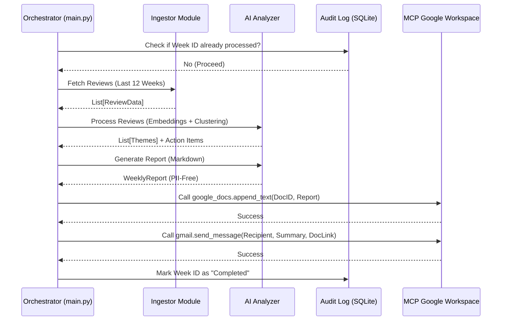
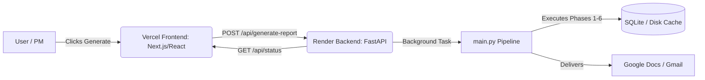

# Detailed Architecture: Weekly Product Review Pulse System

## 1. System Vision
An agent-centric, automated pipeline that transforms raw user feedback into high-signal product intelligence. The system is designed for **autonomous execution**, using **MCP (Model Context Protocol)** as the secure bridge to Google Workspace.

---

## 2. Core Architecture (Agent-Friendly View)



---

## 3. Module Specifications & Interfaces

### 3.1 Ingestion Module (`src/ingestor.py`)
*   **Responsibility**: Fetch reviews without exceeding rate limits.
*   **Input**: `product_id`, `platform` (ios/android).
*   **Output**: `List[dict]` containing `rating`, `title`, `text`, `date`, `version`.
*   **Constraint**: Must implement a "rolling window" filter (current date - 84 days).

### 3.2 AI Analysis Module (`src/analyzer.py`)
*   **Step 1 (Vectors)**: Generate embeddings for `review_text`.
*   **Step 2 (Clustering)**:
    *   `UMAP`: Compress vectors to 5D.
    *   `HDBSCAN`: Identify clusters with `min_cluster_size=5`.
*   **Step 3 (LLM Refinement)**:
    *   **Prompt**: "Based on these [N] user reviews, identify the core theme and extract 3 verbatim quotes."
    *   **Safety**: Explicit instruction to **fail** if PII is detected.

### 3.3 Delivery Module (`src/mcp_delivery.py`)
This module abstracts the **MCP Tool Calls** to prevent hardcoding tool names elsewhere.
*   **`append_to_doc(report_text)`**: Calls `google_docs.append_text`.
*   **`send_summary_email(doc_link)`**: Calls `gmail.send_message` with a templated subject: `[Report] Weekly Product Pulse - {Date}`.

---

## 4. Data Safety & Integrity

| Feature | Implementation |
| :--- | :--- |
| **Idempotency** | Uses a composite key `(product_id, ISO_week_year)` in `audit_log.db` to prevent double-posting. |
| **PII Scrubbing** | Regex-based removal of emails, phone numbers, and Aadhaar/PAN patterns before LLM ingestion. |
| **Truthfulness** | The prompt forces the LLM to provide the `review_id` alongside quotes to verify they are real. |

---

## 5. Directory Structure (Optimized)
```text
/
├── app.py                 # FastAPI Web Server (Render)
├── main.py                # Pipeline Orchestrator
├── src/
│   ├── ingestor.py        # Raw data collection
│   ├── analyzer.py        # ML (Clustering) + LLM (Reasoning)
│   ├── report_generator.py# Logic to format final Markdown
│   └── mcp_delivery.py    # MCP Tool Interface
├── data/
│   ├── audit_log.db       # Persistent execution state
│   └── raw_cache/         # (Optional) Store raw reviews for 1 week
├── requirements.txt       # umap-learn, hdbscan, sentence-transformers
└── .env.example           # MCP Server Configs & API Keys
```

---

## 6. How an Agent (AI) Should Run This
1.  **Initialize**: Run `python main.py --check-only` to see if a report is due.
2.  **Analyze**: Run `python main.py --mode analyze` to preview clusters.
3.  **Deliver**: Run `python main.py --mode full` to execute the MCP calls and update the audit log.

---

## 7. Full-Stack Web Architecture
To expose the Python pipeline to stakeholders via a web interface, the system uses a decoupled **Frontend/Backend** architecture:



### Backend (Render / FastAPI)
* **Entrypoint**: `app.py`
* Exposes `POST /api/generate-report` which asynchronously triggers `main.py` via a `subprocess` or `BackgroundTask` to prevent HTTP timeouts.
* **Authentication**: Requires `.env` and `google_token.json` uploaded to Render environment variables to bypass browser OAuth flow.

### Frontend (Vercel / React)
* **Design**: Dashboard interface to view past summaries and trigger new ones.
* Connects to the Render FastAPI server via CORS.
